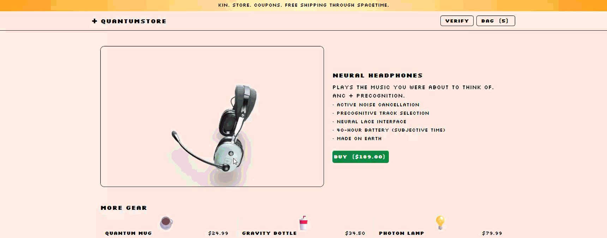

# Invisible Break

> A storefront that looks perfect — but Kane CLI catches what screenshots miss.

[](https://invisible-break.druxamb.dev)
[](https://nextjs.org)
[](https://kane.ai)
[](https://druxamb.dev)



**Live:** [invisible-break.druxamb.dev](https://invisible-break.druxamb.dev) · **Demo Video:** [YouTube](https://www.youtube.com/watch?v=75YiS1YXzW8)

Built for the **Kane CLI Online Hackathon**. This project demonstrates a **closed-loop** interaction between an AI coding agent and Kane CLI: the agent writes code, Kane verifies it with DevTools assertions (console errors, 5xx network errors), and the watcher feeds failures back to the agent for fixing — automatically, on every save.

---

## The Problem

Visual regression tests (screenshots) catch what users *see*. They miss what users *experience*: silent console errors, failed background API calls, and degraded features that look fine but are broken underneath. These are **invisible breaks** — bugs that ship to production because they don't affect the screenshot.

## The Solution

**Invisible Break** seeds two such breaks in a storefront:

1. **Console error** — The checkout flow tries to read `window.__APP_CONFIG__.featureFlags` which is undefined. The page renders fine (graceful degradation), but the console fills with errors.
2. **Silent 500** — The checkout flow fetches `/api/shipping-rates?broken=1` which returns 500 (misconfigured shipping service URL). The page falls back to a default rate, so the user never notices. But the network tab shows a 500.

A screenshot test passes. Kane CLI catches both — with 98% confidence.

## The Closed Loop

```
Code change
  → Watcher detects (file save)
  → Kane runs flows (DevTools assertions)
  → failure.md generated (agent-ready report)
  → Agent reads + fixes
  → Save triggers re-run
  → Green
```

1. The **watcher** monitors `src/` for file changes.
2. On save, it runs `kane-cli testmd run` against the local app.
3. Kane executes the test flow with DevTools assertions — checking for console errors and 5xx responses.
4. If breaks are found, the watcher generates `watcher-output/failure.md` — a structured report with evidence (error excerpts, HTTP status codes, step numbers, bug verdict with confidence score).
5. The agent reads `failure.md`, patches the code, and saves.
6. The save triggers another Kane run. If the fix works, the dashboard goes green.

---

## Demo

### Live URLs

| URL | What it does |
|---|---|
| [invisible-break.druxamb.dev](https://invisible-break.druxamb.dev) | The storefront — 3D product previews, cart, checkout |
| [invisible-break.druxamb.dev/?breaks=true](https://invisible-break.druxamb.dev/?breaks=true) | Same store with invisible breaks activated |
| [invisible-break.druxamb.dev/dashboard](https://invisible-break.druxamb.dev/dashboard) | Kane verification dashboard (redirects to overlay) |

### How to try it (60 seconds)

1. **Open the store** — browse products, rotate the 3D models, add to cart. Everything looks perfect. A screenshot test would pass.
2. **Click VERIFY** in the header — the dashboard overlay boots up showing the red state: "2 INVISIBLE BREAKS FOUND" with failure cards, bug verdict at 98% confidence.
3. **Click ⚠ TRY INVISIBLE BREAKS** — the cart panel slides in with breaks enabled. The page still looks normal, but an info panel explains what's happening behind the scenes.
4. **Open DevTools** (F12) — see the console errors and the 500 on `/api/shipping-rates` for yourself.
5. **Click → SEE KANE CLI CATCH THEM** — back on the dashboard, see the structured failure report that an agent would read to fix the code.

### Demo video

See [`DEMO_VIDEO_SCRIPT.md`](../DEMO_VIDEO_SCRIPT.md) for the exact click-by-click recording script.

---

## Architecture

```
invisible-break/
├── src/
│   ├── app/
│   │   ├── page.tsx                  # Store homepage (server component)
│   │   ├── LandingClient.tsx         # Store UI (client) — cart, checkout, breaks
│   │   ├── ProductViewer.tsx         # 3D model viewer (react-three-fiber)
│   │   ├── DashboardOverlay.tsx      # Verification dashboard (full-screen overlay)
│   │   ├── dashboard/page.tsx        # Redirects to /?dashboard=true
│   │   └── api/
│   │       ├── shipping-rates/route.ts  # Returns 500 when ?broken=1 (invisible break #2)
│   │       └── watcher/
│   │           ├── run/route.ts      # POST: trigger Kane run
│   │           └── status/route.ts   # GET: current watcher state
│   └── lib/
│       ├── products.ts               # Product data + 3D model paths + attributions
│       ├── cart.ts                   # Cart state (cookie-based)
│       ├── actions.ts                # Server actions (add to cart, checkout)
│       └── watcher/
│           ├── kane-watcher.ts       # Runs Kane CLI, parses NDJSON, generates failure.md
│           ├── file-watcher.ts       # Monitors src/ for changes
│           ├── state-store.ts        # File-based state (survives Next.js dev reloads)
│           └── index.ts              # CLI entry point
├── kane-tests/
│   ├── checkout_flow_test.md         # Kane test flow with DevTools assertions
│   └── output-checkout_flow/         # Committed recordings (replayable at zero cost)
├── watcher-output/                   # Runtime output (failure.md, state.json)
└── .testmuai/evidence/               # Kane evidence packs
```

### Key design decisions

- **Single-page architecture** — cart and checkout are a slide-out panel, not separate routes. The dashboard is a full-screen overlay. No page refreshes during the demo flow.
- **CRT boot animation** — both the store and dashboard "boot up" like arcade cabinets using GSAP (scaleY snap, scanline sweep, content stagger).
- **3D product previews** — each product has a real `.glb` model rendered with react-three-fiber, auto-rotating with orbit controls.
- **Production simulation** — on Vercel, the "Run Verification" button simulates a Kane cycle (3s delay → falls back to committed red-state recording). Locally, it runs the real Kane CLI.

---

## Running Locally

### Prerequisites

- Node.js 22+
- Kane CLI (`npm install -g @testmuai/kane-cli`)
- Kane CLI account (login with `kane-cli login`)

### Setup

```bash
npm install
npm run dev          # Start the store on http://localhost:3000
```

### Run the watcher

```bash
# Run Kane verification once (replay mode — free, uses committed recordings)
npm run watch:run

# Run with fresh authoring (costs credits, but catches live breaks)
npm run watch:fresh

# Watch mode — re-runs Kane on every file save
npm run watch
```

### The closed loop

1. Start the dev server: `npm run dev`
2. Start the watcher: `npm run watch`
3. Open the store: http://localhost:3000
4. Click VERIFY in the header to see the dashboard
5. Edit any file in `src/` — the watcher detects the change and re-runs Kane
6. If breaks are found, `watcher-output/failure.md` is generated
7. The agent reads the report, fixes the code, saves — and the loop continues

> **Important:** Do NOT commit `kane-tests/output-checkout_flow/Result.md` after a local green run. The committed recording is the **red state** — the dashboard depends on it. If you accidentally overwrite it, restore with:
> ```bash
> git checkout 244713c -- kane-tests/output-checkout_flow/Result.md kane-tests/output-checkout_flow/.internal/
> ```

---

## Kane Test Flow

The test flow (`kane-tests/checkout_flow_test.md`) has 4 steps:

1. **Open the store** — assert "QuantumStore" is visible, no console errors
2. **Add to cart** — click BUY, assert bag count increases, no console errors
3. **Open checkout** — click BAG, click CHECKOUT, assert form is visible, **no console errors**, **no 5xx API calls** ← catches both breaks
4. **Submit checkout** — fill form, submit, assert confirmation appears

Steps 1–2 pass. Step 3 fails — Kane's DevTools assertions catch the console error and the 500. Step 4 is skipped.

The committed recording (session `5a262895`) captures this red state. Judges can replay it at zero credit cost using `npm run watch:run`.

---

## Tech Stack

| Layer | Technology |
|---|---|
| Framework | Next.js 16 (App Router, TypeScript, Turbopack) |
| 3D Rendering | Three.js + @react-three/fiber + @react-three/drei |
| Animation | GSAP (CRT boot sequence, entrance animations) |
| Styling | Tailwind CSS 4 (FRANKY'S arcade design system) |
| Verification | Kane CLI (DevTools assertions: console errors, network 5xx) |
| Deployment | Vercel |

---

## 3D Model Credits

All models are loaded from local `.glb` files in `/public`. Licensed under Creative Commons:

| Product | Model | Author | License |
|---|---|---|---|
| Quantum Mug | [Car Mug 1](https://skfb.ly/KErN) | VirtualBG | CC BY-NC 4.0 |
| Neural Headphones | [David Clark Pilot Headset](https://skfb.ly/o8Vs9) | simon_fischer | CC BY 4.0 |
| Gravity Bottle | [Vacuum Bottle](https://skfb.ly/KLIJ) | VirtualBG | CC BY-NC 4.0 |
| Photon Lamp | [Desk lamp](https://skfb.ly/6XZwF) | HASSAN | CC BY 4.0 |

---

## Credits

Built by [DruxAMB](https://druxamb.dev).

Verified with [Kane CLI](https://kane.ai) — DevTools-aware test automation.
